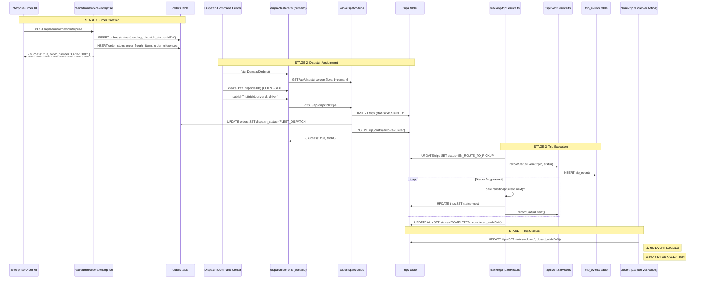

# Technical Audit: Enterprise Order → Trip Closure Workflow

**Audit Date:** January 7, 2026  
**Auditor Role:** Senior Software Architect & Logistics Ops Manager  
**Scope:** Enterprise Order Creation → Dispatch Assignment → Trip Execution → Trip Closure

---

## 1. Flow Diagram



---

## 2. Data Ownership & Source of Truth

| Lifecycle Stage | Data Owner | Source of Truth | Client State | Audit Trail |
|-----------------|------------|-----------------|--------------|-------------|
| **Order Entry** | `app/api/admin/orders/enterprise/route.ts` | `orders` table | None (form state) | ❌ None |
| **Dispatch Planning** | `lib/stores/dispatch-store.ts` | **CLIENT ZUSTAND STORE** | `draftTrips[]` | ❌ None |
| **Trip Assignment** | `app/api/dispatch/trips/route.ts` | `trips` table | Sync on refresh | ❌ None |
| **Trip Execution** | `services/tracking/src/services/tripService.ts` | `trips` table | N/A (backend) | ✅ `trip_events` |
| **Trip Closure** | `app/actions/close-trip.ts` | `trips` table | N/A | ❌ **NONE** |

### Critical Finding: Dual Sources of Truth

**⚠️ RED FLAG:** During dispatch planning, the `draftTrips` array in the Zustand client store is the **sole source of truth**. If the browser crashes or the user navigates away, all draft trip data is lost. This is only persisted client-side via `persist` middleware but never written to the database until `publishTrip()` is called.

---

## 3. State Machine Integrity

### Allowed Transitions (from `statusMachine.ts`)

| Current Status | Allowed Next Status(es) |
|----------------|------------------------|
| `PLANNED` | `ASSIGNED`, `CANCELLED` |
| `ASSIGNED` | `EN_ROUTE_TO_PICKUP`, `CANCELLED` |
| `EN_ROUTE_TO_PICKUP` | `AT_PICKUP`, `DELAYED` |
| `AT_PICKUP` | `LOADING`, `DELAYED` |
| `LOADING` | `DEPARTED_PICKUP`, `DELAYED` |
| `DEPARTED_PICKUP` | `IN_TRANSIT`, `EN_ROUTE_TO_DELIVERY`, `CUSTOMS_HOLD` |
| `IN_TRANSIT` | `EN_ROUTE_TO_DELIVERY`, `DELAYED`, `CUSTOMS_HOLD` |
| `CUSTOMS_HOLD` | `IN_TRANSIT`, `EN_ROUTE_TO_DELIVERY` |
| `EN_ROUTE_TO_DELIVERY` | `AT_DELIVERY`, `DELAYED` |
| `AT_DELIVERY` | `UNLOADING`, `DELAYED` |
| `UNLOADING` | `DELIVERED`, `DELAYED` |
| `DELIVERED` | `COMPLETED` |
| `COMPLETED` | `CLOSED` |
| `CLOSED` | *(terminal)* |
| `CANCELLED` | *(terminal)* |
| `DELAYED` | *(any prior active state)* |

### Enforcement Points

| File | Enforces State Machine? | Transition Validation |
|------|-------------------------|----------------------|
| `tripService.ts::updateTripStatus()` | ✅ **YES** | Calls `canTransition()` |
| `app/api/dispatch/trips/route.ts` | ❌ **NO** | Hardcodes `status='ASSIGNED'` |
| `app/actions/close-trip.ts` | ❌ **NO** | Direct SQL `SET status='closed'` |
| `app/api/trip-events/route.ts` | ❌ **NO** | Updates status without validation |
| `app/api/trips/[id]/events/route.ts` | ❌ **NO** | Updates `orders.status` without validation |
| `services/tracking/src/routes/customs.ts` | ❌ **NO** | Direct SQL `SET status='CUSTOMS_HOLD'` |

### Illegal Transition Vectors

1. **`close-trip.ts` Server Action**
   - Can close ANY trip regardless of current status
   - Example: `PLANNED` → `closed` bypasses entire lifecycle
   - No event recorded

2. **`/api/dispatch/trips` POST**
   - Creates trip directly with `status='ASSIGNED'`
   - Skips `PLANNED` state entirely
   - No event recorded in `trip_events`

3. **Direct SQL Updates in migration/fix scripts**
   - Multiple `.js` scripts perform direct `UPDATE trips SET status=...`
   - Examples: `sync-statuses.js`, `fix-db-tables.js`

---

## 4. The 'Happy Path' vs. Reality

### Happy Path
```
Order Created → Draft Trip → Assigned → En Route → Delivered → Completed → Closed
```

### Exception Scenarios

| Scenario | What Happens | Order State | Data Integrity |
|----------|--------------|-------------|----------------|
| **Trip Cancelled** | `status='CANCELLED'` | ⚠️ **UNDEFINED** - No rollback logic | ❌ Order stuck in `FLEET_DISPATCH` |
| **Driver Unassigned** | N/A - No unassign function for trips | N/A | ❌ No mechanism exists |
| **Trip Deleted (Draft)** | Orders returned to `demandOrders[]` | ✅ Correct in UI | ❌ DB not touched (client-only) |
| **Browser Crash (Draft)** | Zustand `persist` may recover | Depends on middleware | ⚠️ Risk of lost work |
| **API Failure on Publish** | `refreshAll()` called | Orders stay in `demandOrders` | ✅ Recoverable |

### Missing Rollback Logic

**No mechanism exists to return an Order to `pending` status after:**
- Trip cancellation
- Driver unassignment
- Failed delivery

The `dispatch-store.ts` has `unassignFromFleet()` for individual orders, but this only updates `orders.assigned_driver_id` - it does **not**:
- Delete or update the associated `trips` record
- Reset `orders.dispatch_status` to `NEW`
- Create any audit trail

---

## 5. Auditability Audit

### Files That Write to `trips` Table

| File | Operation | Audit Event? | Notes |
|------|-----------|--------------|-------|
| `services/tracking/src/services/tripService.ts::createTrip()` | INSERT | ✅ Kafka + trip_events | **Gold standard** |
| `services/tracking/src/services/tripService.ts::updateTripStatus()` | UPDATE | ✅ Kafka + trip_events | **Gold standard** |
| `services/tracking/src/services/tripService.ts::closeTrip()` | UPDATE | ✅ Kafka | **Good** |
| `services/tracking/src/services/tripService.ts::updateTripFields()` | UPDATE | ⚠️ No event | Non-status fields |
| `services/tracking/src/services/tripLocationService.ts` | UPDATE | ❌ None | Location updates |
| `app/api/dispatch/trips/route.ts` | INSERT | ❌ **NONE** | **RED FLAG** |
| `app/actions/close-trip.ts` | UPDATE | ❌ **NONE** | **RED FLAG** |
| `services/tracking/src/routes/customs.ts` | UPDATE | ❌ None | Status bypass |
| `fix-db-tables.js` | UPDATE | ❌ None | Script |
| `fix-miles-tracking.js` | UPDATE | ❌ None | Script |
| `fix-trip-tracking-columns.js` | UPDATE | ❌ None | Script |
| `migrate-customer-schema.js` | UPDATE | ❌ None | Migration |
| `scripts/convert-orders-to-trips.js` | INSERT | ❌ None | Migration |

### Files That Write to `orders` Table

| File | Operation | Audit Event? | Notes |
|------|-----------|--------------|-------|
| `app/api/admin/orders/enterprise/route.ts` | INSERT | ❌ **NONE** | **RED FLAG** |
| `app/api/dispatch/trips/route.ts` | UPDATE | ❌ **NONE** | dispatch_status change |
| `app/api/orders/[id]/route.ts` | UPDATE | ❌ None | Status changes |
| `app/api/trip-events/route.ts` | UPDATE | ❌ None | Cascaded status |
| `services/orders/src/services/orderService.ts` | INSERT/UPDATE | ❌ None | |
| `sync-statuses.js` | UPDATE | ❌ None | Script |

### Audit Gap Summary

| Table | INSERT Logged | UPDATE Logged | Kafka Events |
|-------|---------------|---------------|--------------|
| `orders` | ❌ | ❌ | ❌ |
| `trips` | ⚠️ Partial | ⚠️ Partial | ⚠️ Partial |
| `trip_events` | N/A (audit table) | N/A | ✅ |

---

## 6. Red Flag List

### 🚨 Critical (Data Integrity Risk)

| # | File | Function/Line | Issue |
|---|------|---------------|-------|
| 1 | `app/actions/close-trip.ts` | `closeTrip()` | Bypasses state machine, no event logged, can close any status |
| 2 | `app/api/dispatch/trips/route.ts` | `POST` | Creates trip with `ASSIGNED` status, no `PLANNED` state, no event |
| 3 | `lib/stores/dispatch-store.ts` | `createDraftTrip()` | Client-only state, no DB persistence of planning data |
| 4 | `app/api/admin/orders/enterprise/route.ts` | `POST` | No audit trail for order creation |

### ⚠️ High (Operational Risk)

| # | File | Function/Line | Issue |
|---|------|---------------|-------|
| 5 | `services/tracking/src/routes/customs.ts:507` | Direct UPDATE | Status set to `CUSTOMS_HOLD` without `canTransition()` check |
| 6 | `dispatch-store.ts::deleteDraftTrip()` | Client only | Orders returned to UI state but DB unchanged |
| 7 | Multiple fix scripts | Direct SQL | Ad-hoc status changes without validation |

### 🟡 Medium (Maintainability)

| # | File | Issue |
|---|------|-------|
| 8 | `tripService.ts` vs `close-trip.ts` | Duplicate close logic with different behavior |
| 9 | `trip_costs` | Auto-calculated on dispatch, but no recalc mechanism on route change |

---

## 7. Production Gaps Checklist

### Order Entry

- [ ] **POD (Proof of Delivery) capture** - No document upload workflow
- [ ] **BOL (Bill of Lading) generation** - `require_bol` flag exists but no implementation
- [ ] **Customer credit check** - No integration before order acceptance
- [ ] **Rate confirmation** - No customer signature/acknowledgment flow
- [ ] **Audit log** - No record of who created the order or when
- [ ] **Duplicate order detection** - No de-duplication logic

### Dispatch

- [ ] **Driver conflict check** - No HOS (Hours of Service) validation
- [ ] **Unit capacity validation** - Utilization calculated but not enforced
- [ ] **Driver qualification match** - Equipment type not validated against driver certifications
- [ ] **Draft trip persistence** - Lost on browser close
- [ ] **Multi-user conflict resolution** - Two dispatchers could assign same driver

### Trip Execution

- [ ] **Geofence arrival detection** - Manual status updates only
- [ ] **ETA recalculation on delay** - No real-time ETA update
- [ ] **Accessorial capture** - Schema exists but no runtime workflow
- [ ] **Driver mobile app integration** - No evidence of driver-facing app
- [ ] **Photo documentation at stops** - Not implemented

### Trip Closure

- [ ] **Mandatory POD verification** - Can close without documents
- [ ] **Rate confirmation before invoicing** - No approval workflow
- [ ] **Variance analysis** - `actual_miles` vs `planned_miles` not flagged
- [ ] **Driver settlement generation** - No payroll integration
- [ ] **Invoice generation** - No billing system integration
- [ ] **Audit trail** - `close-trip.ts` creates no paper trail

### Cross-Cutting

- [ ] **Role-based access control** - No authorization on any API
- [ ] **Idempotency keys** - No protection against duplicate submissions
- [ ] **Soft delete** - Hard deletes used (see `seed-drivers-units.js`)
- [ ] **Data retention policy** - No archival strategy

---

## 8. Sanity Checklist

| Status | Data Owner | Lifecycle Stage | Source of Truth | Auditability | Downstream Impacts |
|--------|------------|-----------------|-----------------|--------------|-------------------|
| `pending` | Order API | Order Created | `orders` table | ❌ None | Appears in Dispatch demand pool |
| `NEW` (dispatch_status) | Order API | Ready for Dispatch | `orders` table | ❌ None | Selectable in Command Center |
| *Draft Trip* | Client Store | Planning | Zustand `draftTrips[]` | ❌ None | ⚠️ Lost on crash |
| `PLANNED` | Tracking Service | **SKIPPED** | - | - | **Not used in current flow** |
| `ASSIGNED` | Dispatch API | Trip Created | `trips` table | ❌ None | Order linked to driver |
| `FLEET_DISPATCH` | Dispatch API | Order Assigned | `orders` table | ❌ None | Order removed from pool |
| `EN_ROUTE_TO_PICKUP` | Tracking Service | Driver Moving | `trips` table | ✅ trip_events | ETA visible |
| `AT_PICKUP` | Tracking Service | Arrived | `trips` table | ✅ trip_events | Dwell clock starts |
| `LOADING` | Tracking Service | Loading | `trips` table | ✅ trip_events | Capacity added |
| `DEPARTED_PICKUP` | Tracking Service | Left Pickup | `trips` table | ✅ trip_events | In-transit begins |
| `IN_TRANSIT` | Tracking Service | Moving | `trips` table | ✅ trip_events | Location tracking |
| `CUSTOMS_HOLD` | Customs Route | Border | `trips` table | ⚠️ Partial | Clearance workflow |
| `AT_DELIVERY` | Tracking Service | Arrived | `trips` table | ✅ trip_events | Dwell clock starts |
| `UNLOADING` | Tracking Service | Unloading | `trips` table | ✅ trip_events | - |
| `DELIVERED` | Tracking Service | POD Captured | `trips` table | ✅ trip_events | Revenue recognized |
| `COMPLETED` | Tracking Service | Trip Done | `trips` table | ✅ trip_events | Ready for closeout |
| `closed` | Close Action | Finalized | `trips` table | ❌ **NONE** | Billing trigger (assumed) |
| `CANCELLED` | Tracking Service | Aborted | `trips` table | ✅ trip_events | ⚠️ Order orphaned |

---

## 9. Recommendations

### Immediate (P0)

1. **Add event logging to `close-trip.ts`**
   ```typescript
   // After UPDATE trips
   await recordStatusEvent(tripId, 'CLOSED', { triggeredBy: 'user', reason: 'Manual close' });
   ```

2. **Add state machine validation to `close-trip.ts`**
   ```typescript
   const trip = await getTrip(tripId);
   if (!canTransition(trip.status, TripStatus.CLOSED)) {
     throw new Error(`Cannot close trip in ${trip.status} status`);
   }
   ```

3. **Log order creation events**
   - Add `order_events` table or use existing `trip_events` pattern

### Short-Term (P1)

4. **Persist draft trips to database**
   - Create `draft_trips` table
   - Save on each modification

5. **Unify trip creation paths**
   - Route all trip creation through `tripService.ts::createTrip()`
   - Remove direct INSERT in `/api/dispatch/trips`

6. **Add rollback logic for cancellation**
   - Reset `orders.dispatch_status` to `NEW` when trip cancelled

### Medium-Term (P2)

7. **Implement POD verification gate**
   - Block `DELIVERED` → `COMPLETED` without POD document

8. **Add idempotency keys to all mutating endpoints**

9. **Implement role-based access control**

---

## 10. Conclusion

The system has a **well-designed state machine** in `statusMachine.ts` but **multiple bypass vectors** undermine its integrity. The tracking service (`tripService.ts`) is the gold standard for status updates with full audit trails, but the Next.js API routes and server actions operate outside this boundary.

**Primary Risk:** The `close-trip.ts` server action can finalize any trip regardless of operational state, with no audit trail. This could result in:
- Invoices generated for cancelled trips
- Revenue recognition before delivery
- Compliance violations (no paper trail)

**Secondary Risk:** Draft trips exist only in browser memory until published. A browser crash during a high-volume dispatch session could lose significant work.

**Remediation Priority:**
1. Audit logging for all state changes
2. State machine enforcement at all entry points
3. Database persistence for planning-stage data

---

## 11. Database Table Usage Analysis

**Total Tables:** 45 (including views)

### Tables Actively Used in Application Code

| Table | Primary Usage | API/Service Location |
|-------|---------------|---------------------|
| `accessorial_types` | SELECT | Order services |
| `business_rules` | SELECT | Costing rules |
| `carrier_bids` | CRUD | `/api/dispatch/orders/[id]/bids` |
| `carrier_profiles` | SELECT, JOIN | Dispatch routes |
| `costing_rules` | SELECT | Costing service |
| `customers` | SELECT, JOIN | Multiple API routes |
| `customs_activity_log` | SELECT, INSERT | Customs service |
| `customs_agents` | SELECT, UPDATE | Customs routes |
| `customs_clearances` | SELECT, UPDATE | Customs routes |
| `customs_documents` | SELECT, INSERT | Customs routes |
| `dispatch_actions` | SELECT, INSERT | Dispatch routes |
| `dispatches` | CRUD | Dispatch service |
| `distance_cache` | Functions/Views | Distance service |
| `driver_profiles` | SELECT, JOIN | Multiple API routes |
| `event_rules` | SELECT, JOIN | Event service |
| `event_types` | SELECT | Event service |
| `locations` | CRUD | Locations API |
| `market_lanes` | SELECT | Analytics |
| `order_accessorials` | SELECT, INSERT | Order finalize route |
| `order_billing` | SELECT, INSERT | Order billing |
| `order_freight_items` | SELECT, INSERT | Order creation |
| `order_references` | SELECT, INSERT | Order creation |
| `order_stops` | SELECT, INSERT | Order creation |
| `orders` | Full CRUD | Multiple API routes |
| `schema_migrations` | SELECT, INSERT | DB init |
| `trailers` | SELECT, JOIN, UPDATE | Fleet management |
| `trip_costs` | CRUD | Trip costing |
| `trip_events` | SELECT, INSERT | `/api/trips/[id]/events`, tracking service |
| `trip_exceptions` | CRUD | Exception handling |
| `trip_locations` | SELECT, INSERT | Tracking service |
| `trip_stops` | CRUD | Trip service |
| `trips` | Full CRUD | Multiple API routes |
| `unit_profiles` | SELECT, JOIN, UPDATE | Fleet management |
| `week_miles_summary` | UPSERT | Miles tracking |

### Views (Derived from Base Tables)

| View | Purpose |
|------|---------|
| `active_trip_locations` | Real-time location aggregation |
| `dispatch_available_drivers` | Available driver calculation |
| `trailer_pool_availability` | Trailer pool stats |
| `trip_event_timeline` | Event history view |
| `unit_status_summary` | Fleet status overview |
| `v_distance_cache_stats` | Distance cache analytics |
| `v_trips_missing_distance` | Data quality check |

### ❌ UNUSED TABLES (Candidates for Removal)

| Table | Notes | Recommendation |
|-------|-------|----------------|
| `orders_backup_pre_uuid` | Migration backup from UUID conversion | **Safe to drop** - historical backup no longer needed |
| `rate_cards` | Exists with seed data, no app queries | Implement feature or remove |
| `reference_types` | App uses hardcoded array instead of DB table | Remove table or refactor to use it |

### Cleanup Actions

```sql
-- Drop unused backup table
DROP TABLE IF EXISTS orders_backup_pre_uuid;

-- Evaluate rate_cards - either implement or drop
-- SELECT * FROM rate_cards; -- Review data first

-- reference_types - decision needed on approach
-- Currently hardcoded in components/orders/new/ReferenceTab.tsx
```
